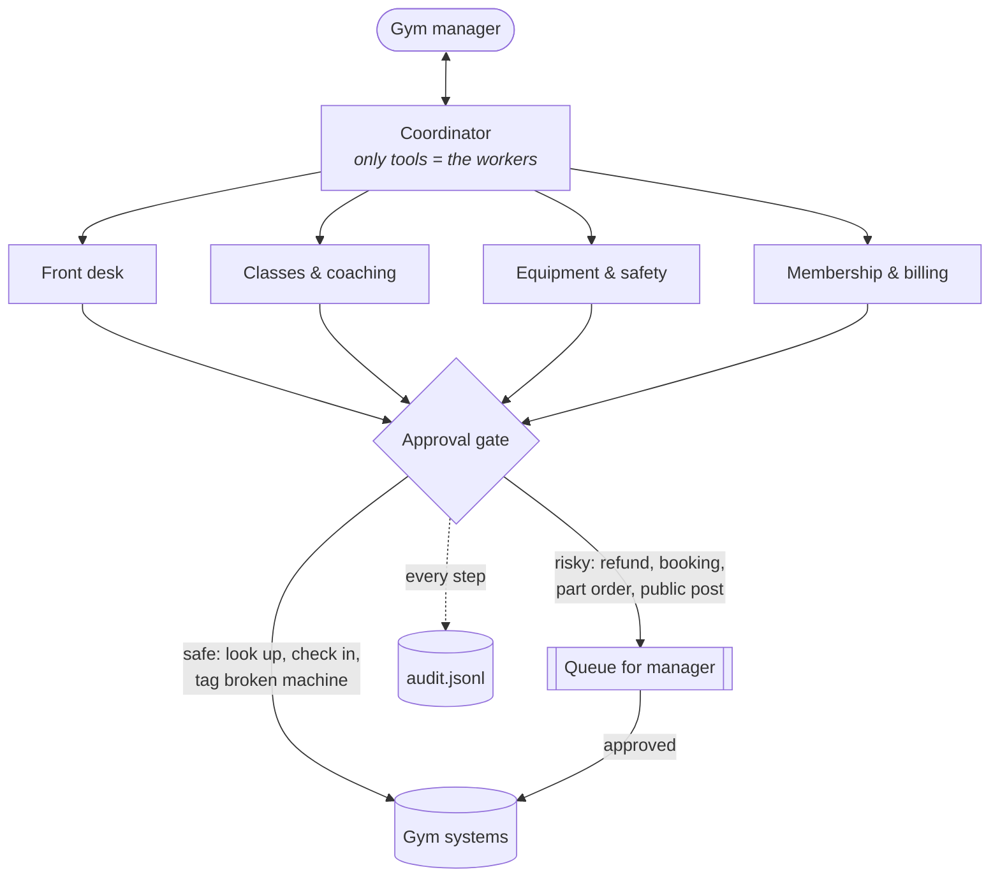

# Gym Staff Agents

A personal project exploring how AI agents can help gym staff, built in Python with Claude.

One **coordinator** agent talks to the gym manager and hands work to four narrow **worker** agents: front desk, classes, equipment, and membership. Anything that **spends money, commits the gym to a member, or goes public** stops at an **approval gate** until a human says yes.

The gym is fictional (Iron Oak Gym), but the problem is real. Small gyms run on a few people juggling check-ins, broken machines, billing questions and class changes. This project shows how AI can take the busywork without being trusted with the risky decisions.



## See it in action

Open [`docs/index.html`](docs/index.html) in a browser for a clickable demo: pick a request, watch the coordinator hand work to each worker, and approve or reject what's waiting. It's a simulation with sample data, so no API key is needed.

## Why I built this

Strength training is a big part of my life. I've trained for years and competed in amateur bodybuilding, so I've seen the front-desk side of a lot of gyms: a staff of two handling a billing question, a broken leg press and a line at check-in all at once.

I wanted to explore what AI helpers could look like in that setting, with one firm rule: they can take care of the routine work, but anything that costs money or affects a member waits for a person to approve it. This project is also part of my focus on building tools for the strength training and sports industry with Python.

## What the helpers can do

| Worker | Runs right away | Waits for approval |
| --- | --- | --- |
| **Front desk** | look up members, check them in, draft messages | send a message, post an announcement |
| **Classes** | see the schedule, see trainer availability | book personal training, cancel a class |
| **Equipment** | list issues, **take an unsafe machine out of order** | order a replacement part |
| **Membership** | look up plan, balance and notes | freeze a membership, issue a refund |

Taking a broken machine out of service runs immediately on purpose: it's reversible, and waiting could get someone hurt. Ordering the part costs money, so it waits.

## Try it

```bash
pip install -r requirements.txt
export ANTHROPIC_API_KEY=your-key-here

python main.py                                          # morning brief
python main.py "Marcus says he was charged twice"       # any request
python main.py "Book Ana a session with Dani this week"
```

After the coordinator answers, you approve or reject each queued action one by one. Every automatic action, queue, approval and rejection is appended to `audit.jsonl`.

Set `GYM_AGENTS_MODEL` to use a different Claude model.

## Tests

```bash
pytest
```

The tests run offline with a scripted fake model, so no API key is needed. They check the guarantees that matter:

- safe tools run immediately
- risky tools are queued and **never** run without approval
- a rejected action never runs, and an approved one runs exactly once
- a worker can't use a tool outside its job (the equipment worker can't issue refunds)
- the coordinator has no direct access to gym systems
- every step lands in the audit log

## Design choices

- **Narrow workers.** Each worker has a one-paragraph job and only the tools that job needs. Small agents are easier to test, cheaper to run and easier to trust.
- **The coordinator can't touch anything.** Its only tools are the workers, so every real action passes through a worker's allow-list and the gate.
- **Approval lives in code, not the prompt.** The model is *told* about approvals, but `approval.py` is what actually stops an action.
- **Honest tool results.** A queued action returns "NOT carried out", so the agent reports it as waiting, not done.
- **Audit by default.** You can always answer "who did what, and who approved it?"

## Project layout

| Path | What it is |
| --- | --- |
| `gym_agents/data.py` | The in-memory demo gym: members, classes, trainers, equipment |
| `gym_agents/tools.py` | Gym tools, each marked safe or `requires_approval` |
| `gym_agents/approval.py` | The approval gate and audit trail |
| `gym_agents/workers.py` | The four workers: job description + tool allow-list |
| `gym_agents/runner.py` | The tool-use loop, and allow-list enforcement |
| `gym_agents/coordinator.py` | The coordinator and the morning brief |
| `main.py` | Command line with interactive approvals |
| `tests/` | Offline tests with a fake client |

## Taking it further

The demo gym lives in memory. For a real gym you'd swap the tool functions for the gym's member software, booking app and payment processor (often through MCP connectors), send the approval queue to wherever the manager already is (Slack, SMS, a phone notification), and run the morning brief on a schedule before opening.

## License

MIT
